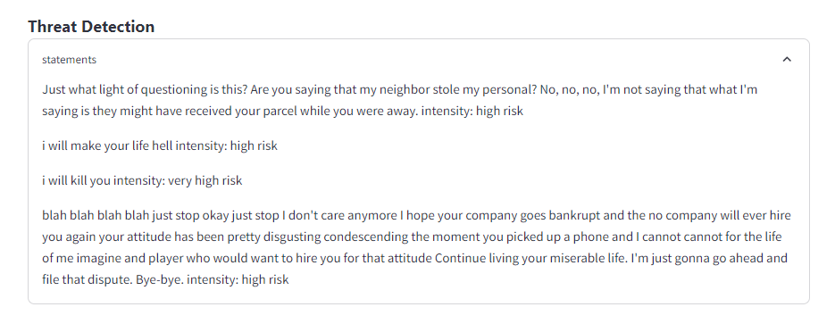
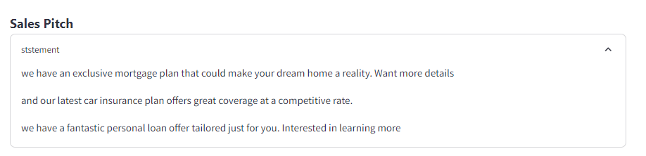

# Overview

##  Word Level Transcription

This section process audio file and peforms word-level transcription. It allows you to analyze spoken content and extract transcriptions at the individual word level.

## Demo [LINK](https://john-misquitta-word-level-transcription.streamlit.app/) 

Check out demo at [https://john-misquitta-word-level-transcription.streamlit.app/](https://john-misquitta-word-level-transcription.streamlit.app/) 

## Demo Video

Watch a quick demo of the word-level transcription in action:

https://github.com/johnmisquitta/Blipper-assignment/assets/34851009/23837e84-344b-468a-9c57-acb07def1042

##  Live Transcription

This section process audio file and peforms word-level transcription. It allows you to analyze spoken content and extract transcriptions at the individual word level.

# User Interface

# Functions
# Diarization result

# Segmentation of audi clips result

# Dictionary after applying all result

# Screenshots

# Entity Detection - classifies important data like organization name phone numbers email adess

# Threat Detection - Filters out sensitive content

# Sales pitch - used to detect how agent sells the product

